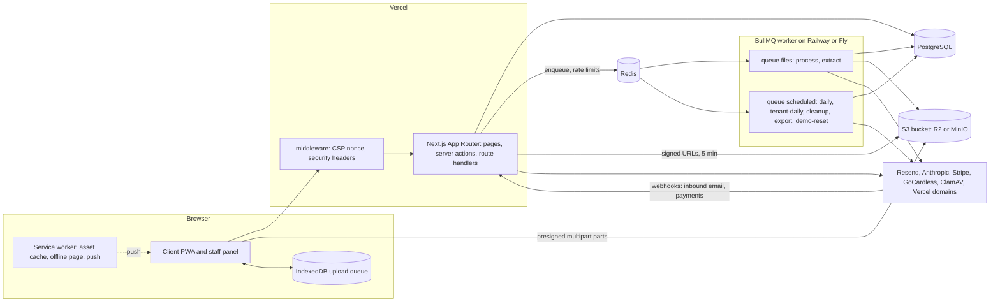
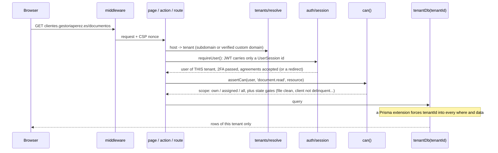
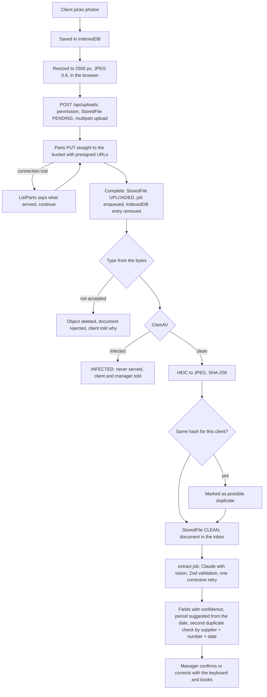
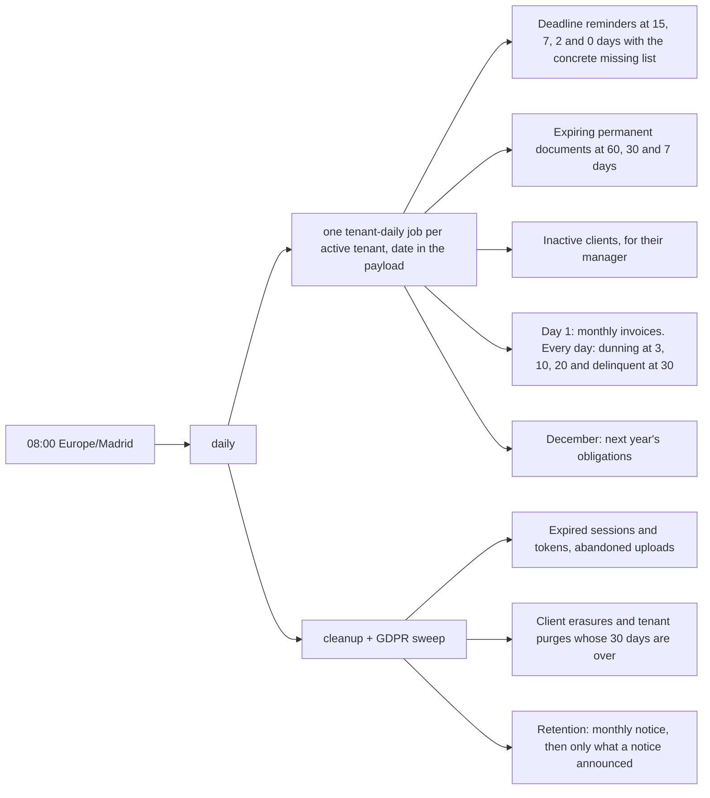
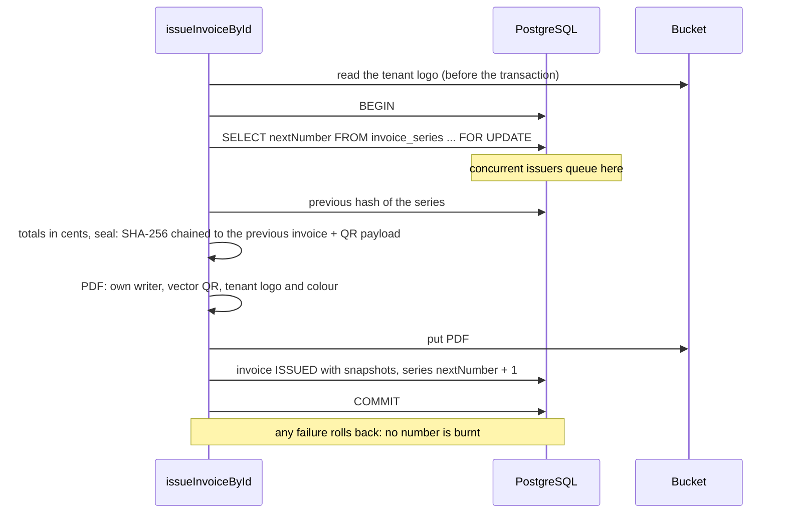

# Architecture in diagrams

The prose lives in the [README](../README.md#architecture) and the reasons in the [ADRs](adr). These are
the pictures: who talks to whom, and what happens to a request, a file, a morning and an invoice.

## The pieces

Every external service sits behind an interface with a development fake (`DocumentExtractor`,
`PaymentProvider`, `DomainProvider`, `EmailDomainProvider`, the antivirus scanner, the email sender), so the
whole product runs on `docker compose up` with no keys.

## A request: tenant, session, permission, data

`modules/tenants/isolation.test.ts` builds a full world of data for tenant B and proves that users of
tenant A cannot list, read, count, update or delete any of it, model by model (the list of models comes
from the Prisma schema, so a new table cannot be forgotten).

## A file: from the phone to the manager's inbox

Downloads have a single door, `/api/files/[id]`: permission check, audit entry, then a signed URL that
lives five minutes. There are no public URLs.

## A morning: the daily job

Every step is idempotent through `ReminderLog` (claim, send, release on failure) or a unique key, so a retry
or a double tick never sends anything twice, and a day without worker is caught up the next morning.

## An invoice: numbering without gaps

Issued invoices are immutable: cancelling issues a rectifying invoice in series `R`. Twelve concurrent
issues produce twelve consecutive numbers in the test suite.
